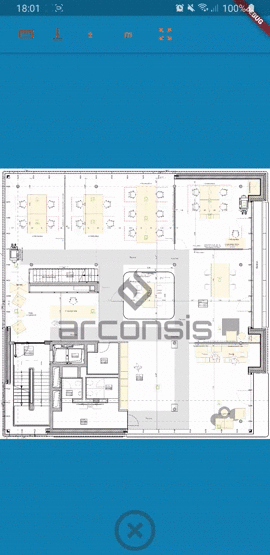
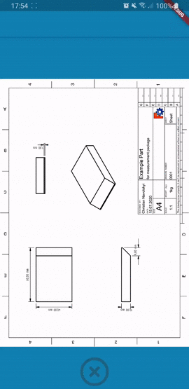
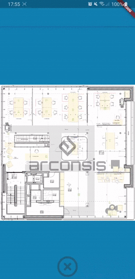
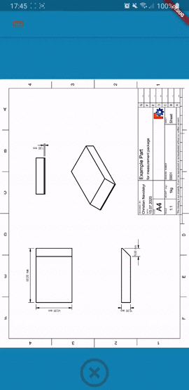
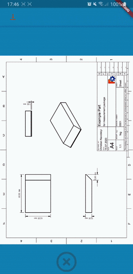
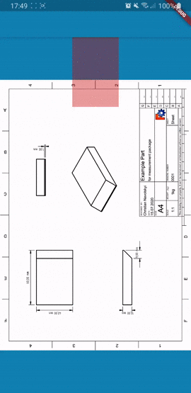
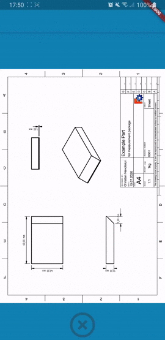
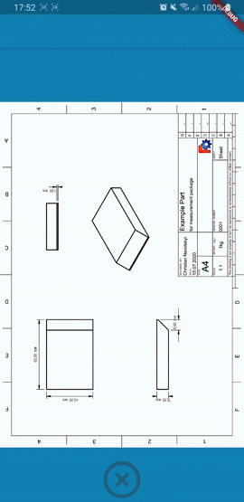
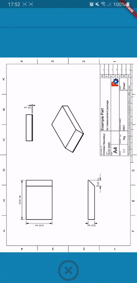

# document_measure


This plugin provides a widget in which you can display another widget, for example, a floor plan of your flat in an image and measure distances between points in your flat.



## Getting Started
To use this plugin simply include `document_measure` in your `pubspec.yaml` and then include it in your code
```dart
include: 'package:document_measure/document_measure.dart'
```

# Usage Overview
* [Functional Usage](#functional-usage)
  * [Using all defaults](#using-all-defaults)
  * [Setting custom paper size, scale and unit of measurement](#setting-custom-paper-size-scale-and-unit-of-measurement)
  * [Toggle between measuring and movement](#toggle-between-measuring-and-movement)
  * [Show and hide distances in the widget](#show-and-hide-distances-in-the-widget)
  * [Getting the distances in code](#getting-the-distances-in-code)
  * [Display your drawing in life-size](#display-your-drawing-in-life-size)
* [Customizability](#customizability)
  * [Deleting points](#deleting-points)
  * [Customizing the magnification glass](#customizing-the-magnification-glass)
  * [Customize the shown distances](#customize-the-shown-distances)
  * [Customize the points and lines](#customize-the-points-and-lines)

## Functional Usage

### Using all defaults
``` Dart
Widget build(BuildContext context) {
  return ...
    Measurements(
      child: Image.asset(
        "assets/images/your-document.png",
      ),
    ),
}
```
This will assume that the paper size of `your-document.png` is A4 (210mm x 297mm) and the content is on a scale of 1:1.
You can place points, move them and see the distance between them in the view.




### Setting custom paper size, scale and unit of measurement
``` Dart
Widget build(BuildContext context) {
  return ...
    Measurements(
      child: Image.asset(
        "assets/images/your-document.png",
      ),
      measurementInformation: MeasurementInformation(
        scale: 1 / 50.0,
        documentWidthInLengthUnits: Millimeter(448),
        documentHeightInLengthUnits: Millimeter(449),
        targetLengthUnit: Meter.asUnit(),
      ),
    ),
}
```
`your-document.png` should now contain a document that is 11in x 17in and has a scale of 1:2. The distances will be displayed in foot.
You can pick a measurement unit by setting `targetLengthUnit` to\
`Meter.asUnit()` for meters,\
`Millimeter.asUnit()` for millimeters,\
`Inch.asUnit()` for inches and\
`Foot.asUnit()` for foot.

The document size can also be described with the above units by using the default constructor with the amount.\
`Meter(x.y)` for meter\
`Millimeter(x.y)` for millimeter\
`Inch(x.y)` for inches\
`Foot(x.y)` for foot



### Toggle between measuring and movement
You can switch between setting points for measuring and zooming/moving by changing the `measure` parameter.
``` Dart
bool measure = true;

void toggle() {
  setState(() {
    measure = !measure;
  });
}

Widget build(BuildContext context) {
  return ...
    Measurements(
      child: Image.asset(
        "assets/images/your-document.png",
      ),
      measure: measure,
    ),
}
```



### Show and hide distances in the widget
As with the measure parameter, you can also toggle the distances on the lines between the points on and off.
``` Dart
bool showDistances = true;

void toggle() {
  setState(() {
    showDistances = !showDistances;
  });
}

Widget build(BuildContext context) {
  return ...
    Measurements(
      child: Image.asset(
        "assets/images/your-document.png",
      ),
      showDistanceOnLine: showDistances,
    ),
}
```



### Getting the distances in code
Since not seeing the distances defeats the purpose of the widget you can still access them by passing a `MeasurementController` which lets you access the distances between the points and the tolerance of the measurement.
You can listen to the stream of measurements or access the distances and tolerance separately through the `MeasurementController`.
``` Dart
MeasurementController controller = MeasurementController();

void setupController() {
  controller.measurements.listen((measurement) {
    print("Distances: ${measurement.distances}");
    print("Tolerance: ${measurement.tolerance}");
  });
}

void accessValues() {
  final distances = controller.distances;
  final tolerance = controller.tolerance;

  ...
}

Widget build(BuildContext context) {
  return ...
    Measurements(
      child: Image.asset(
        "assets/images/your-document.png",
      ),
      controller: controller,
    ),
}
```

### Display your drawing in life-size
For smaller parts, you can use the `MeasurementController` to zoom your document to life-size. (The maximal magnification is 10, which might not be sufficient for larger documents or bigger scales)
Simply call `MeasurementController::zoomToLifeSize` to set the magnification accordingly and `MeasurementController::resetZoom` to reset the magnification to `1`.
``` Dart
MeasurementController controller = MeasurementController();

void zoomToLifeSize() {
  controller.zoomToLifeSize();
}

void resetZoom() {
  controller.resetZoom();
}

Widget build(BuildContext context) {
  return ...
    Measurements(
      child: Image.asset(
        "assets/images/your-document.png",
      ),
      controller: controller,
    ),
}
```


## Customizability

### Deleting points
By default, an icon will be displayed at the bottom centre which will remove a point when it is being dragged into the icon and released there.
But you can also set your own custom widget by passing a widget to the `deleteChild` parameter and align it by setting `deleteChildAlignment` accordingly.
``` Dart
Widget build(BuildContext context) {
  return ...
    Measurements(
      child: Image.asset(
        "assets/images/your-document.png",
      ),
      deleteChild: Container(
        width: 100,
        height: 150,
        color: Color.fromARGB(100, 200, 0, 0),
      ),
      deleteChildAlignment: Alignment.topCenter,
    ),
}
```



### Customizing the magnification glass
When you place your finger on the screen to set a point you hide the position with your finger, too bad, but that's why we have a magnification glass build in and you can even customize it.
Change the magnification factor by setting `magnificationZoomFactor` and to change the appearance of the magnification glass set `magnificationStyle` with your style.
``` Dart
Widget build(BuildContext context) {
  return ...
    Measurements(
      child: Image.asset(
        "assets/images/your-document.png",
      ),
      magnificationZoomFactor: 5.0,
      magnificationStyle: MagnificationStyle(
        magnificationColor: Color.fromARGB(255, 200, 50, 80),
        magnificationRadius: 100,
        outerCircleThickness: 5,
        crossHairThickness: 2,
      ),
    ),
}
```



### Customize the shown distances
You can change how many decimal places you want to be displayed on the lines, whether the tolerance should be shown and which color the distance should the drawn in.
``` Dart
Widget build(BuildContext context) {
  return ...
    Measurements(
      child: Image.asset(
        "assets/images/your-document.png",
      ),
      distanceStyle: DistanceStyle(
        textColor: Color.fromARGB(255, 200, 50, 80),
        numDecimalPlaces: 4,
        showTolerance: true,
      ),
    ),
}
```



### Customize the points and lines
The size and color of the points and lines can be changed with the `pointStyle` parameter.
You can choose between a solid line by using 
```Dart
SolidLine(double lineWidth, Color lineColor)
```
and a dashed line by using 
```Dart
DashedLine(double dashWidth, double dashLength, double dashDistance, Color lineColor)
```

``` Dart
Widget build(BuildContext context) {
  return ...
    Measurements(
      child: Image.asset(
        "assets/images/your-document.png",
      ),
      pointStyle: PointStyle(
        dotColor: Color.fromARGB(255, 200, 50, 80),
        dotRadius: 10,
        lineType: DashedLine(
          dashWidth: 4,
          dashLength: 10,
          dashDistance: 2,
          lineColor: Color.fromARGB(255, 50, 200, 80),
        ),
      ),
    ),
}
```



# License
This project is licensed under the [MIT-License](https://github.com/arconsis/measurements/blob/master/LICENSE).


